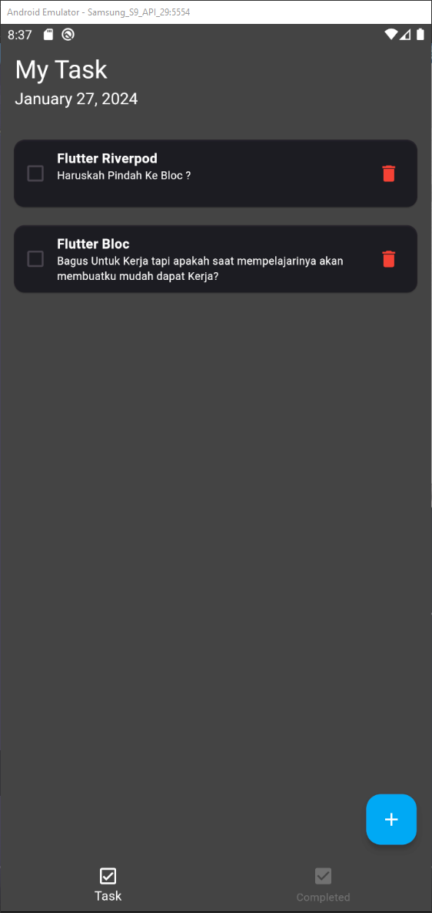
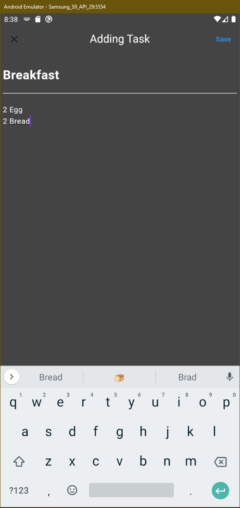
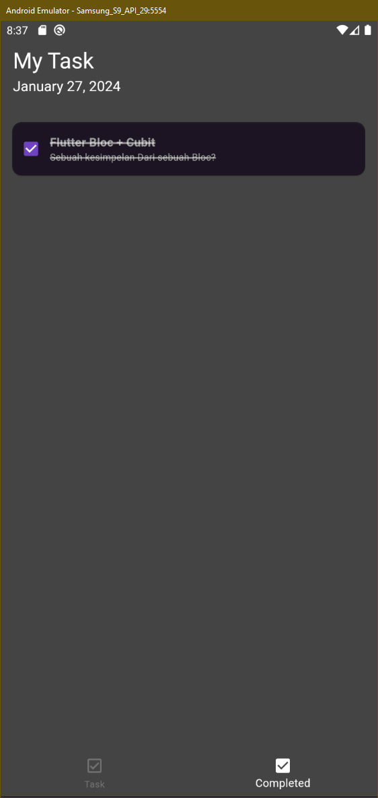

# to_do_list_riverpod

Simple To Do Task with SqLite and Riverpod

## Getting Started

My First Time using SQLite and Riverpod so I'll try it in this project just simple think todo
tasking for handle your tasks everyday

## Content

- [x] Riverpod
- [x] SQLite
- [x] Go Router

## Preview Project

 
  
<h2>🛠️ My Favorite Tools</h2>

  

    <h3>Uncompleted Task</h3>
    
  

  

    <h3>Adding Task</h3>
    
  

  

    <h3>Completed Task</h3>
    
  

    <h3>Video Task</h3>
    

